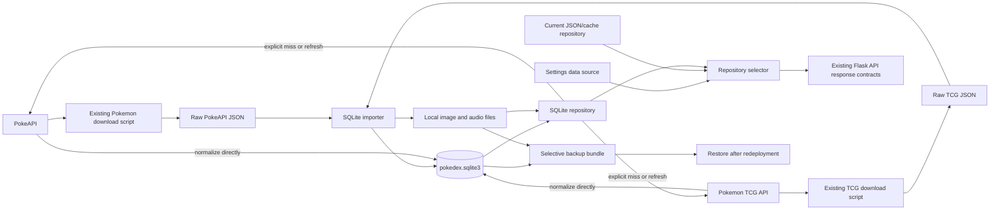
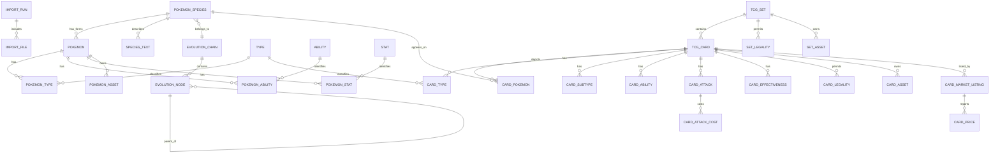

# SQLite Data Model Proposal

Status: **Approved for phased implementation.**

## Decision Summary

Use a single SQLite database as the production source of truth for Pokemon,
species, evolution, TCG card, set, latest price, and local asset metadata. Keep
the existing API download scripts and raw JSON directories only as reproducible
seed material. Add a separate import step that validates and normalizes those
snapshots into SQLite.

The application should continue returning its current JSON response shapes.
Routes and tool handlers will read through a repository interface whose active
implementation is selected in Settings:

- **JSON seed mode**: preserve current behavior temporarily for migration and
  contract comparison; this is not a production runtime target.
- **SQLite/local mode**: query normalized tables and return local image URLs.

SQLite mode never falls back to JSON. Normal reads use only SQLite and local
assets. An explicit lookup or refresh may call an upstream API when data is
missing or stale, but successful responses are normalized directly into SQLite
rather than written as runtime JSON cache files. A failed upstream lookup
returns a clear unavailable state.

## Goals

- Replace feature-specific scans and duplicate JSON-derived indexes with
  indexed SQL queries.
- Support the Pokemon index, search, filters, detail pages, evolution data,
  TCG gallery, set browsing, card detail, and prices from one data model.
- Preserve raw API responses so imports are repeatable and source changes can
  be diagnosed.
- Serve local Pokemon and TCG images in SQLite mode instead of image URLs stored
  in API payloads.
- Import every PokeAPI form, not only default National Pokedex entries.
- Support selective backup and restore of the database and downloaded assets.

## Non-goals

- Storing image or audio bytes as SQLite BLOBs.
- Removing the raw download scripts or raw archives.
- Changing frontend response contracts as part of the database migration.
- Building user collection/history tables in the first database iteration.
- Treating SQLite as a multi-writer or horizontally scaled database.
- Retaining historical TCG prices in the first database iteration.

## Data Flow



## Relationship Overview



## Conventions

- Table and column names use `snake_case`.
- Integer booleans have `CHECK (value IN (0, 1))` constraints.
- API identifiers are retained as primary keys where stable. Internal-only
  entities use `INTEGER PRIMARY KEY`.
- Dates use ISO 8601 text (`YYYY-MM-DD`); timestamps use UTC ISO 8601 text.
- Ordered API arrays include a `slot` or `sort_order` column.
- Local asset paths are project-relative POSIX-style paths, never machine-
  absolute paths.
- Foreign keys are enabled for every connection with `PRAGMA foreign_keys=ON`.
- The database uses WAL mode for concurrent Flask reads and atomic importer
  replacement.

## Import Provenance

Raw payloads remain files rather than database BLOBs. These tables make each
database build traceable to those files.

### `import_run`

| Column | Type | Constraints | Purpose |
| --- | --- | --- | --- |
| `id` | INTEGER | PK | Import run identifier |
| `started_at` | TEXT | NOT NULL | UTC start timestamp |
| `completed_at` | TEXT | | UTC completion timestamp |
| `status` | TEXT | NOT NULL, CHECK | `running`, `completed`, or `failed` |
| `importer_version` | TEXT | NOT NULL | Schema/import code version |
| `schema_version` | INTEGER | NOT NULL | Database schema version |
| `error_message` | TEXT | | Failure summary |

### `import_file`

| Column | Type | Constraints | Purpose |
| --- | --- | --- | --- |
| `id` | INTEGER | PK | Imported file identifier |
| `import_run_id` | INTEGER | FK `import_run.id`, NOT NULL | Owning run |
| `source_kind` | TEXT | NOT NULL, CHECK | `pokeapi`, `tcg`, or `asset` |
| `resource_kind` | TEXT | NOT NULL | `pokemon`, `species`, `evolution`, `type`, `card_search`, or `set` |
| `relative_path` | TEXT | NOT NULL | Raw project-relative path |
| `sha256` | TEXT | NOT NULL | Change and duplicate detection |
| `source_cached_at` | TEXT | | Timestamp from cache wrapper |
| `imported_at` | TEXT | NOT NULL | UTC import timestamp |
| `record_count` | INTEGER | NOT NULL DEFAULT 0 | Records accepted from file |

Unique constraint: `UNIQUE(import_run_id, relative_path)`.

## Pokemon Tables

### `pokemon_species`

One row per National Pokedex species. Form-specific data belongs in `pokemon`.

| Column | Type | Constraints |
| --- | --- | --- |
| `id` | INTEGER | PK |
| `name` | TEXT | NOT NULL, UNIQUE, COLLATE NOCASE |
| `generation_name` | TEXT | |
| `evolution_chain_id` | INTEGER | FK `evolution_chain.id` |
| `color_name` | TEXT | |
| `shape_name` | TEXT | |
| `habitat_name` | TEXT | |
| `growth_rate_name` | TEXT | |
| `capture_rate` | INTEGER | |
| `base_happiness` | INTEGER | |
| `gender_rate` | INTEGER | |
| `hatch_counter` | INTEGER | |
| `is_baby` | INTEGER | NOT NULL DEFAULT 0 |
| `is_legendary` | INTEGER | NOT NULL DEFAULT 0 |
| `is_mythical` | INTEGER | NOT NULL DEFAULT 0 |

### `pokemon`

One row per PokeAPI Pokemon/form. The default row drives the index.

| Column | Type | Constraints |
| --- | --- | --- |
| `id` | INTEGER | PK |
| `species_id` | INTEGER | FK `pokemon_species.id`, NOT NULL |
| `name` | TEXT | NOT NULL, UNIQUE, COLLATE NOCASE |
| `display_order` | INTEGER | NOT NULL |
| `is_default` | INTEGER | NOT NULL DEFAULT 0 |
| `base_experience` | INTEGER | |
| `height_decimetres` | INTEGER | |
| `weight_hectograms` | INTEGER | |

Indexes: `(display_order)`, `(species_id, is_default)`, and `(name COLLATE NOCASE)`.

### Lookup and junction tables

| Table | Important columns | Key/relationship |
| --- | --- | --- |
| `type` | `id`, `name` | Unique type name |
| `pokemon_type` | `pokemon_id`, `type_id`, `slot` | PK `(pokemon_id, type_id)` |
| `ability` | `id`, `name` | Unique ability name |
| `pokemon_ability` | `pokemon_id`, `ability_id`, `slot`, `is_hidden` | PK `(pokemon_id, ability_id, slot)` |
| `stat` | `id`, `name` | Unique stat name |
| `pokemon_stat` | `pokemon_id`, `stat_id`, `base_stat`, `effort` | PK `(pokemon_id, stat_id)` |
| `species_text` | `species_id`, `language`, `version_name`, `text_kind`, `text` | Names, genera, and flavor text; indexed by species/language/kind |

`species_text.text_kind` is constrained to `name`, `genus`, or
`flavor_text`. Keeping language and version explicit avoids selecting an
arbitrary English flavor entry during import.

### Evolution tables

| Table | Important columns | Purpose |
| --- | --- | --- |
| `evolution_chain` | `id`, `baby_trigger_item_name` | PokeAPI chain identity |
| `evolution_node` | `id`, `chain_id`, `species_id`, `parent_node_id`, `sort_order` | Self-referencing evolution tree |
| `evolution_condition` | `node_id`, `trigger_name`, `item_name`, `held_item_name`, `known_move_name`, `known_move_type_name`, `location_name`, `min_level`, `min_happiness`, `min_beauty`, `min_affection`, `time_of_day`, `gender`, `needs_overworld_rain`, `turn_upside_down`, `relative_physical_stats` | Conditions required to reach a node |

`evolution_condition` has an integer primary key because a node may expose
multiple valid evolution-detail alternatives.

### `pokemon_asset`

| Column | Type | Constraints | Purpose |
| --- | --- | --- | --- |
| `id` | INTEGER | PK | Asset identity |
| `pokemon_id` | INTEGER | FK `pokemon.id`, NOT NULL | Owning Pokemon/form |
| `asset_kind` | TEXT | NOT NULL | `official_artwork`, `home`, `dream_world`, `showdown`, `sprite`, `cry_latest`, or `cry_legacy` |
| `local_path` | TEXT | | Project-relative local file |
| `source_url` | TEXT | | Provenance and explicit refresh source |
| `media_type` | TEXT | | MIME type |
| `sha256` | TEXT | | Integrity/change detection |
| `width` | INTEGER | | Image width when applicable |
| `height` | INTEGER | | Image height when applicable |

Unique constraint: `UNIQUE(pokemon_id, asset_kind)`. SQLite mode returns an
application URL derived from `local_path`; it does not return `source_url` as
the display URL.

## TCG Tables

### `tcg_set`

| Column | Type | Constraints |
| --- | --- | --- |
| `id` | TEXT | PK |
| `name` | TEXT | NOT NULL |
| `series` | TEXT | |
| `printed_total` | INTEGER | |
| `total` | INTEGER | |
| `ptcgo_code` | TEXT | |
| `release_date` | TEXT | |
| `api_updated_at` | TEXT | |

Indexes: `(release_date DESC)` and `(name COLLATE NOCASE)`.

### `tcg_card`

| Column | Type | Constraints |
| --- | --- | --- |
| `id` | TEXT | PK |
| `set_id` | TEXT | FK `tcg_set.id`, NOT NULL |
| `name` | TEXT | NOT NULL, COLLATE NOCASE |
| `number` | TEXT | NOT NULL |
| `supertype` | TEXT | |
| `level` | TEXT | |
| `hp` | INTEGER | |
| `evolves_from` | TEXT | |
| `converted_retreat_cost` | INTEGER | |
| `rarity` | TEXT | |
| `artist` | TEXT | |
| `flavor_text` | TEXT | |
| `regulation_mark` | TEXT | |
| `rules_text` | TEXT | | Newline-joined rules for display/search |

Indexes: `(name COLLATE NOCASE)`, `(set_id, number)`, `(rarity)`, and `(hp)`.
The importer parses numeric HP; unparseable or absent API values become NULL.

### Card relationships

| Table | Important columns | Key/relationship |
| --- | --- | --- |
| `card_pokemon` | `card_id`, `species_id` | PK `(card_id, species_id)` from `nationalPokedexNumbers` |
| `card_type` | `card_id`, `type_id`, `slot` | PK `(card_id, type_id)` |
| `card_subtype` | `card_id`, `subtype`, `slot` | PK `(card_id, subtype)` |
| `card_ability` | `id`, `card_id`, `name`, `ability_type`, `text`, `sort_order` | Ordered abilities |
| `card_attack` | `id`, `card_id`, `name`, `damage`, `text`, `converted_energy_cost`, `sort_order` | Ordered attacks |
| `card_attack_cost` | `attack_id`, `energy_type`, `slot` | PK `(attack_id, slot)` |
| `card_effectiveness` | `card_id`, `effect_kind`, `type_name`, `value`, `sort_order` | Weaknesses and resistances |
| `card_retreat_cost` | `card_id`, `energy_type`, `slot` | PK `(card_id, slot)` |
| `card_legality` | `card_id`, `format_name`, `status` | PK `(card_id, format_name)` |
| `set_legality` | `set_id`, `format_name`, `status` | PK `(set_id, format_name)` |

`card_effectiveness.effect_kind` is constrained to `weakness` or `resistance`.
TCG energy names may not map exactly to PokeAPI type names, so
`card_attack_cost`, `card_retreat_cost`, and `card_effectiveness` retain the
source text. `card_type` maps known values to the shared `type` lookup.

### TCG assets

| Table | Important columns | Purpose |
| --- | --- | --- |
| `card_asset` | `id`, `card_id`, `asset_kind`, `local_path`, `source_url`, `media_type`, `sha256`, `width`, `height` | Small/large card images |
| `set_asset` | `id`, `set_id`, `asset_kind`, `local_path`, `source_url`, `media_type`, `sha256` | Set logo/symbol images |

Unique constraints are `(card_id, asset_kind)` and `(set_id, asset_kind)`.
`asset_kind` is `small` or `large` for cards and `logo` or `symbol` for sets.
The existing `tcg-image-cache/images/` files should be registered here rather
than copied into the database.

### Market and price tables

| Table | Important columns | Purpose |
| --- | --- | --- |
| `card_market_listing` | `id`, `card_id`, `provider`, `listing_url`, `source_updated_at` | One listing per provider/card |
| `card_price` | `listing_id`, `variant`, `metric`, `amount`, `currency` | Provider-specific price observations |

Unique constraints:

- `card_market_listing(card_id, provider)`
- `card_price(listing_id, variant, metric)`

Examples are provider `tcgplayer`, variant `holofoil`, metric `market`; and
provider `cardmarket`, variant `standard`, metric `trend_price`. This structure
supports both APIs without adding a column every time a provider introduces a
new price metric. The first importer stores the latest snapshot only. Historical
price tracking can later add `observed_at` to the price key.

## Schema Versioning & Migrations

All schema changes follow an incremental, versioned migration pattern:

- **Migration Scripts Directory**: `data/schema/`
- **Catalog Database Migrations**: `001.sql`, `002.sql`, etc. Tracked via `SCHEMA_VERSION` in `src/db/database.py`.
- **User Database Migrations**: `users-001.sql`, `users-002.sql`, `users-003.sql`, etc. Tracked via `USERS_SCHEMA_VERSION` in `src/db/database.py`.
- **Version Tracking**: SQLite's native `PRAGMA user_version` stores the applied integer schema version on each database file.
- **Boot Migration**: On application startup, `apply_catalog_schema()` and `apply_users_schema()` check the database version and sequentially apply any newer numbered scripts without dropping tables or overwriting user data.
- **Adding Future Migrations**:
  1. Add a new sequentially numbered file in `data/schema/` (e.g. `users-004.sql`).
  2. Write incremental DDL (`ALTER TABLE`, `CREATE TABLE`, `CREATE INDEX`) ending with `PRAGMA user_version = <N>;`.
  3. Bump `SCHEMA_VERSION` or `USERS_SCHEMA_VERSION` in `src/db/database.py`.

## Runtime Compatibility Views

SQL views are useful for common filters, but Python repository methods should
assemble nested response objects. SQLite JSON functions are not required.

### `pokemon_index_view`

One row per default Pokemon with ID, name, display order, dimensions, flags,
and comma-separated type/ability labels. Used by index, search suggestions,
random selection, and filter counts. Detailed arrays still come from junction
queries to avoid parsing concatenated values.

### `tcg_card_index_view`

One row per card with set metadata, local thumbnail path, HP, rarity, release
date, and current preferred market price. Used by gallery sorting/filtering and
set previews.

## Query Coverage

| Existing feature | Primary tables/indexes |
| --- | --- |
| Pokemon index | `pokemon` where `is_default=1`, ordered by `display_order` |
| Name/number search | `pokemon.name`, `pokemon.id` |
| Type/ability/legendary filters | Junction indexes plus `pokemon_species` flags |
| Pokemon detail | `pokemon`, species, type, ability, stat, text, and asset tables |
| Evolution display | `evolution_node` self-join ordered by `sort_order` |
| TCG search/filter | `tcg_card` plus card type/subtype and set release indexes |
| Cards for Pokemon | `card_pokemon(species_id, card_id)` |
| Cards in set | `tcg_card(set_id, number)` |
| Card detail | Card relationships, assets, legalities, and prices |
| Set browser | `tcg_set(release_date)` and `set_asset` |
| Image scanner metadata | `tcg_card` and `card_asset`; NumPy vectors remain a specialized artifact |

## Required Junction Indexes

SQLite does not automatically index foreign-key columns. Add these explicitly:

```sql
CREATE INDEX idx_pokemon_type_type ON pokemon_type(type_id, pokemon_id);
CREATE INDEX idx_pokemon_ability_ability ON pokemon_ability(ability_id, pokemon_id);
CREATE INDEX idx_card_pokemon_species ON card_pokemon(species_id, card_id);
CREATE INDEX idx_card_type_type ON card_type(type_id, card_id);
CREATE INDEX idx_card_subtype_value ON card_subtype(subtype, card_id);
CREATE INDEX idx_evolution_node_chain ON evolution_node(chain_id, parent_node_id, sort_order);
CREATE INDEX idx_card_price_lookup ON card_price(listing_id, variant, metric);
```

## Repository Boundary

Introduce matching repository methods rather than branching throughout routes
and views:

```text
PokemonRepository
  list_pokemon(filters, sort, limit, offset)
  get_pokemon(name_or_id)
  get_species(name_or_id)
  get_evolution_chain(chain_id)
  get_type(type_name)

TcgRepository
  search_cards(filters, sort, limit, offset)
  list_sets(limit, offset)
  list_cards_by_set(set_id, limit, offset)
  get_card(card_id)
```

`JsonPokemonRepository` and `JsonTcgRepository` temporarily wrap current
behavior during migration and provide seed-contract comparisons.
`SqlitePokemonRepository` and `SqliteTcgRepository` query this schema and become
the production default. Existing Flask routes and tool handlers depend on the
interfaces, so voice and text chat continue receiving the same data contracts.

## Settings Toggle

During migration, add one persisted setting named `data_source_mode` with
allowed values `json` and `sqlite`. Present it as a two-option segmented control
in the existing Data or Cache section rather than two independent toggles.

Behavior:

1. Default to `json` only until a valid database has been built; deployment
  initialization switches the production default to `sqlite` after validation.
2. Disable the `sqlite` option when the database is absent, has an unsupported
   schema version, or failed integrity checks. Show the reason beside it.
3. Persist the setting server-side so text chat, realtime voice, routes, and
   frontend navigation all use the same source.
4. Switching source invalidates in-memory metadata and current list caches.
5. Existing cache enable/expiry controls apply only to temporary JSON seed mode
  and are visibly disabled or relabeled in SQLite mode.
6. Return active mode and database status from the settings configuration API.
7. Remove JSON mode from production settings after contract migration and
  stabilization; raw JSON remains an importer input, not a runtime fallback.

Suggested status payload:

```json
{
  "data_source_mode": "json",
  "sqlite": {
    "available": false,
    "schema_version": null,
    "last_imported_at": null,
    "pokemon_count": 0,
    "card_count": 0,
    "missing_asset_count": 0,
    "reason": "Database has not been built"
  }
}
```

## Local Asset URL Strategy

Use dedicated Flask asset routes, for example:

```text
/assets/pokemon/<pokemon_id>/<asset_kind>
/assets/tcg/cards/<card_id>/<size>
/assets/tcg/sets/<set_id>/<asset_kind>
```

The route resolves only a database-registered project-relative path and serves
it with `send_from_directory`; callers never supply filesystem paths. Responses
should use long-lived cache headers plus an ETag based on the stored SHA-256.
This keeps deployment paths portable and avoids exposing arbitrary files.

The initial preload downloads official Pokemon artwork only. The other sprite
styles may remain unavailable in SQLite mode until selected for a later asset
download. The current repository contains cached TCG card images, but Pokemon
sprites and some set artwork still appear to be rendered from remote URLs.
SQLite mode therefore should not be marked ready until an asset import/download
pass reports zero required official artwork and primary-view assets.

Pokemon cries remain files referenced by `pokemon_asset`; they are never stored
as SQLite BLOBs. Cry assets are downloaded on first play, written atomically to
the local asset directory, registered in SQLite, and served locally thereafter.
The first playback may stream the upstream response while the completed file is
persisted. Failed or partial downloads are not registered.

## Backup and Restore

Add a production settings workflow that creates and restores a versioned backup
bundle. A multi-select control lets an administrator include:

- SQLite database.
- Pokemon images.
- Pokemon cries downloaded on demand.
- TCG card images.
- TCG set logos and symbols.
- Runtime configuration that is safe to export. Secrets are always excluded.

The backup is a ZIP containing a manifest with bundle version, schema version,
creation timestamp, selected components, file sizes, and SHA-256 hashes. The
database is captured with SQLite's online backup API so the exported copy is
consistent while the app is running. Restore validates every manifest path and
hash, rejects path traversal and unsupported schema versions, places files in a
staging directory, and swaps them into place only after all checks pass.

Backup files must be downloadable by the administrator rather than retained
only on ephemeral App Service storage. Restore is an explicit upload in
Settings. Both operations require the same administrative protection used for
other sensitive settings and must impose upload and expanded-size limits.

## Import and Deployment Strategy

1. Leave numbered raw download scripts intact.
2. Run `python scripts/05-import_sqlite.py`. The importer creates a temporary
   database, imports inside transactions, validates it, then atomically replaces
   the active database.
3. Import all PokeAPI forms exposed by the source dataset.
4. Deduplicate TCG cards by API card ID because raw search files overlap.
5. Upsert lookup tables, then parent tables, then junction/detail tables.
6. Preload official Pokemon artwork, register existing TCG images, and download
  any missing TCG display images during network-enabled hydration. Do not store
  binary content in SQLite; cries are downloaded only when first played.
  If an upstream card record exists but both published image sizes are
  permanently unavailable, generate a clearly labeled local unavailable-image
  card while preserving the upstream URL as provenance.
7. Run `PRAGMA foreign_key_check`, `PRAGMA integrity_check`, row-count checks,
   orphan checks, and representative contract comparisons.
8. Build and hydrate the uncommitted database during initialization or the
  release pipeline. Do not commit the generated database.
9. In production, normalize explicit upstream API results directly into SQLite;
  do not create new runtime JSON cache files.

For an offline structural check, pass `--no-network --skip-artwork`. A complete
production hydration intentionally permits network access because species seeds
identify form and evolution resources that may not exist in the raw archive.
Downloaded artwork resumes by retaining already valid destination files. A
failed database build leaves the active database untouched; the next run
recreates only the temporary `.building` database. When a complete import fails
only at validation, `python scripts/05-import_sqlite.py --resume` repairs missing
assets in the retained build, validates it again, and atomically promotes it.

Suggested project locations:

```text
data/raw/                 # future consolidation target; current folders remain valid initially
data/pokedex.sqlite3      # generated and ignored; built by init/release pipeline
data/schema/001.sql       # versioned DDL
src/repositories/         # repository interfaces and implementations
static/assets/pokemon/    # local Pokemon visual assets
tcg-image-cache/images/   # existing local card images
```

## Validation Gates

SQLite mode is available only when all required gates pass:

- `PRAGMA integrity_check` returns `ok`.
- `PRAGMA foreign_key_check` returns no rows.
- Schema version matches the application-supported version.
- Every PokeAPI Pokemon form is imported; every default Pokemon in the index has
  species, type, and official local artwork records.
- Every imported TCG card has a set and a local display image.
- Duplicate Pokemon IDs/names and duplicate card IDs are zero.
- Representative JSON and SQLite responses are contract-equivalent for at
  least one standard Pokemon, one form variant, one evolution chain, one card,
  one set, and one filtered search.
- The UI makes no remote image request for required primary-view assets while
  SQLite mode is active.
- A backup/restore round trip preserves each selected component and passes all
  database and asset integrity checks.

## Expected Performance

The largest improvement should come from replacing directory scans, partial
file reads, repeated JSON parsing, and duplicated cache payloads with indexed
queries. SQLite will not by itself improve image decode time, but local asset
URLs remove third-party network latency and make browser caching deterministic.

Measure before and after rather than assuming the result:

| Scenario | Metric |
| --- | --- |
| Cold Pokemon index | Server response time, response bytes, first image paint |
| Type + legendary filter | Query/response time |
| Pokemon detail + evolution | Number of filesystem reads and total response time |
| TCG set gallery | Time to first 25 cards and total response bytes |
| Card detail | Response time and local image cache hit |
| Server startup | Time until first successful health request |

## Approved Decisions

1. Import all PokeAPI forms.
2. Preload official Pokemon artwork first; other sprite styles can be added as
  selectable asset downloads later.
3. Store cries as files referenced by SQLite and download them on first use.
4. Store only the latest TCG price values.
5. Do not commit the generated database; build and hydrate it during
  initialization or the release pipeline.
6. SQLite mode is strict and never falls back to JSON. Raw JSON exists to seed
  imports, while subsequent upstream API results populate SQLite directly.
7. Provide selective, versioned backup and restore for the database and asset
  directories so production state survives teardown and redeployment.

## Recommended First Implementation Slice

After approval, implement Pokemon index/search/filter/detail plus official
artwork first. This slice directly replaces the current metadata directory scan
and is small enough to compare JSON and SQLite contracts rigorously. Add TCG
sets/cards/prices and the remaining sprite styles only after that gate passes.